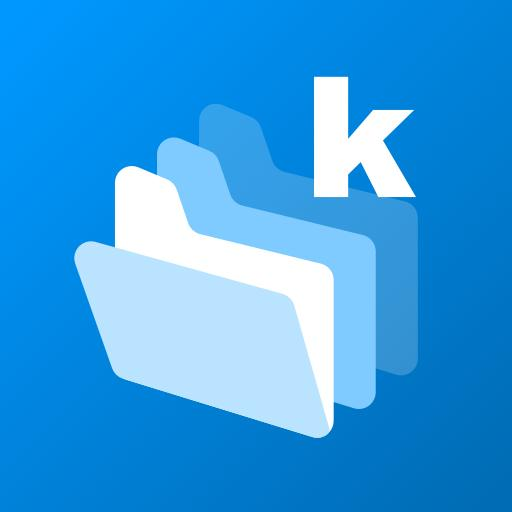

[English](README.md) | **Русский**

 
 

 

# Приложение Infomaniak kDrive

 

## Современное Android-приложение для [kDrive от Infomaniak](https://www.infomaniak.com/kdrive).
### Синхронизация, совместное использование, совместная работа. Швейцарское облако с полной защитой данных.

#### :cloud: Всё необходимое пространство
Ваши фотографии, видео и документы всегда под рукой. kDrive может хранить до 106 ТБ данных.

#### :globe_with_meridians: Экосистема для совместной работы. Всё включено.
Совместная работа онлайн над документами Office, организация встреч, обмен файлами — всё возможно!

#### :lock: kDrive уважает вашу конфиденциальность
Защитите свои данные в суверенном облаке, разработанном и размещённом исключительно в Швейцарии. Infomaniak не анализирует и не продаёт ваши данные.

## Лицензия и вклад
Проект распространяется под лицензией GPLv3.
Если вы обнаружите баг или хотите предложить улучшение, создайте issue для обсуждения. После утверждения мы или вы (в зависимости от приоритетности) займёмся исправлением и сделаем pull request.
Пожалуйста, не отправляйте pull request, не создав предварительно issue для обсуждения.

## Технические детали

### Языки
Макеты созданы с использованием **XML**-компонентов Android. Весь проект написан на **Kotlin**.

### Совместимость
Минимальная версия Android для запуска приложения — Lollipop 5.1 (API 22). Рекомендуем использовать последние версии Android, большинство тестов проводилось на Android 10 и 11 (API 29 и 30).

### Кэш
Для хранения офлайн-файлов, данных об общем доступе, настроек приложения и пользовательских предпочтений используется [Realm.io](https://realm.io/) на обеих платформах (iOS и Android). Для хранения токенов API и основной информации о пользователе применяется Android Room.

### Структура
Структура приложения, алгоритмы и общее функционирование совпадают с iOS-версией.

### Разрешения
| Название разрешения | Использование |
|---|---|
| `GET_ACCOUNTS`, `AUTHENTICATE_ACCOUNTS`, `MANAGE_ACCOUNTS`, `USE_CREDENTIALS` | Доступ и управление AccountManager. |
| `com.infomaniak.permission.ASK_CREDENTIAL`, `com.infomaniak.permission.RECEIVE_CREDENTIAL` | (*Временно не используется*) Позволяет kDrive обмениваться учетными данными с другими приложениями Infomaniak для аутентификации без повторного ввода логина. |
| `INTERNET`, `ACCESS_NETWORK_STATE` | Проверка доступа к Интернету для обновления интерфейса и ограничения функций в офлайн-режиме. |
| `READ_EXTERNAL_STORAGE`, `WRITE_EXTERNAL_STORAGE` | Чтение файлов с устройства для их загрузки в kDrive. Запись используется для скачивания файлов из kDrive и работы с MediaStore. |
| `READ_SYNC_SETTINGS`, `WRITE_SYNC_SETTINGS`, `READ_SYNC_STATS` | Управление автоматической синхронизацией (проверка, включение и т.д.) |
| `RECEIVE_BOOT_COMPLETED` | Определение запуска устройства для перезапуска службы синхронизации. |
| `FOREGROUND_SERVICE` | Используется для фоновой загрузки файлов и службы синхронизации. |
| `REQUEST_IGNORE_BATTERY_OPTIMIZATIONS` | Позволяет скачивать файлы в фоне. |
| `USE_BIOMETRIC` | Используется для блокировки/разблокировки приложения. |
| `REQUEST_INSTALL_PACKAGES` | Позволяет устанавливать APK-файлы из приложения kDrive. |

## Тесты

Для выполнения Unit и UI тестов скопируйте класс `Env-Example` из пакета AndroidTest и назовите его `Env`.
⚠️ Не забудьте отключить двухфакторную аутентификацию (2FA) в аккаунте Infomaniak перед запуском тестов, так как она не поддерживается для теста AddUser.
Замените значения в файле на свои и запускайте тесты 👍
